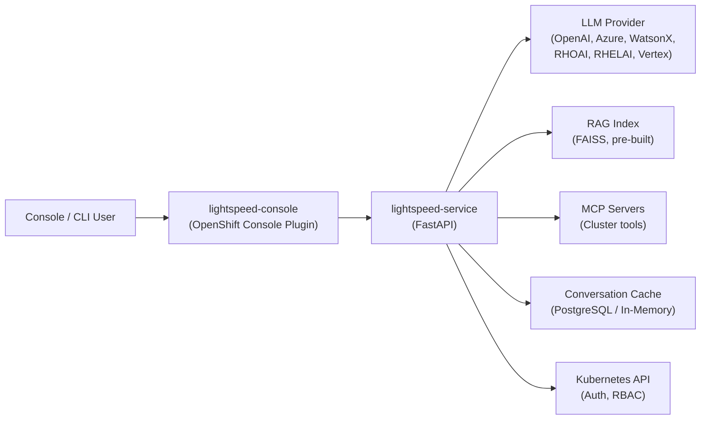
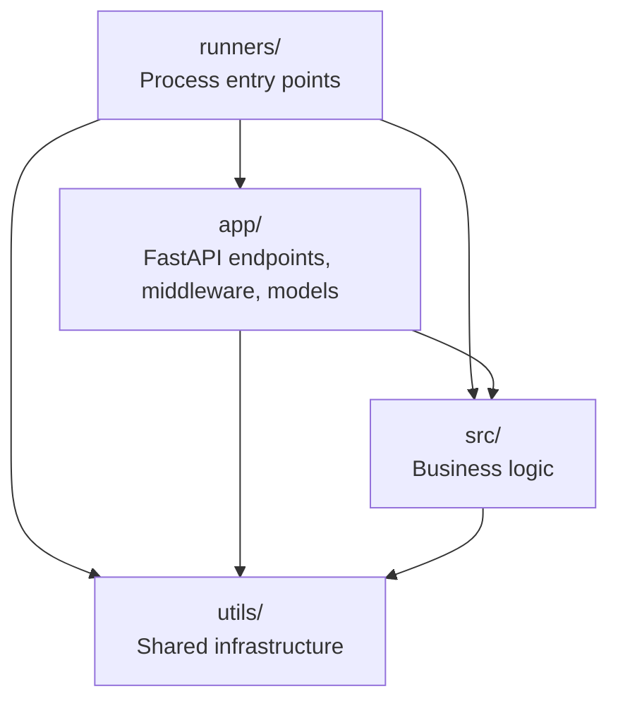
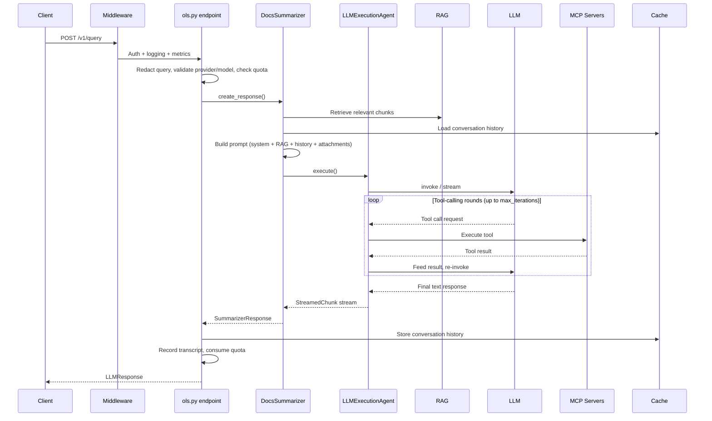

# Architecture

OpenShift LightSpeed (OLS) is an AI-powered assistant that answers natural-language questions about OpenShift and Red Hat products. It orchestrates LLM calls with RAG-augmented prompts, multi-turn conversation history, and live cluster introspection via MCP tools.

## System Context

The service is one component in a larger stack. The **operator** deploys and configures it, the **console plugin** provides the UI, and the **RAG content pipeline** builds the document indexes offline.

## Internal Layers

The codebase is organized into four layers with strict import direction:

- **`app/`** -- HTTP surface. Endpoint routers, Pydantic request/response models, Prometheus metrics, middleware.
- **`src/`** -- Core logic. LLM providers, query processing pipeline, auth, cache, quota, RAG, MCP tools, skills, prompts.
- **`utils/`** -- Infrastructure shared across layers. `AppConfig` singleton, token handling, TLS, redaction, MCP utilities.
- **`runners/`** -- Process orchestration. Uvicorn startup, quota scheduler daemon thread.

## Request Flow

A query request passes through these stages:

## Key Abstractions

### AppConfig Singleton

A process-global singleton (`ols/utils/config.py`) that lazy-initializes subsystems via `@property` and `@cached_property`. Importing `from ols import config` anywhere gives access to configuration, cache, RAG index, quota limiters, and tools RAG. Reload resets all cached properties.

### LLM Provider Registry

Providers self-register via `@register_llm_provider_as("type")` decorator. The registry maps provider type strings to `LLMProvider` subclasses. `load_llm()` looks up the registry, instantiates the provider, and returns a LangChain LLM. The base class handles parameter remapping, TLS, and proxy configuration.

### Token Budget Tracker

Per-request budget management across categories: system prompt, RAG context, history, skills, tool definitions, tool results, and AI rounds. Partitions the context window into prompt budget and tool budget, with per-round caps to prevent any single tool-calling round from consuming the entire budget.

### Cache Abstraction

Abstract `Cache` interface with compound keys (`user_id:conversation_id`). Two backends: in-memory (development) and PostgreSQL (production). Factory pattern selects the implementation from config.

## Deployment

The service runs as a single-worker Uvicorn process inside an OpenShift pod. The operator manages deployment, TLS certificates, and configuration injection. Key constraints:

- **Single worker** -- the AppConfig singleton is process-local; multi-worker would create independent instances.
- **RAG loads in background** -- a thread loads the FAISS index at startup so health probes work immediately.
- **Quota scheduler** -- a daemon thread periodically resets expired quotas in PostgreSQL.
- **FIPS-ready** -- uses FIPS-validated crypto modules; deployable on FIPS-enabled clusters.
- **Disconnected operation** -- all features work without internet if the LLM provider is reachable.

## Key Decisions

| Decision | Rationale |
|---|---|
| FastAPI + single Uvicorn worker | Singleton config pattern; async handles concurrency without multi-process |
| LangChain for LLM abstraction | Unified interface across 8+ provider types; tool-calling and streaming support |
| FAISS for RAG | Pre-built indexes loaded read-only; no runtime indexing needed |
| PostgreSQL for production cache | Multi-replica consistency; advisory locks for concurrency |
| MCP for tool integration | Standard protocol; tools are external and independently deployable |
| Hybrid RAG for tool/skill filtering | Dense + sparse retrieval reduces noise in tool selection |
