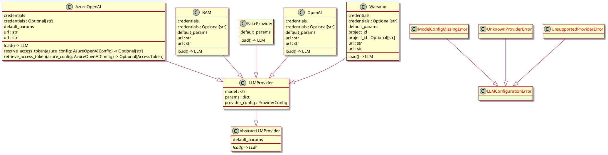

# CONTRIBUTING

<!-- the following line is used by tool to autogenerate Table of Content when the document is changed -->
<!-- vim-markdown-toc GFM -->

* [TLDR;](#tldr)
* [Setting up your development environment](#setting-up-your-development-environment)
* [Definition of Done](#definition-of-done)
    * [A deliverable is to be considered “done” when](#a-deliverable-is-to-be-considered-done-when)
* [Automation](#automation)
    * [Pre-commit hook settings](#pre-commit-hook-settings)
    * [Code coverage measurement](#code-coverage-measurement)
    * [Type hints checks](#type-hints-checks)
    * [Linters](#linters)
    * [Security checks](#security-checks)
* [Testing](#testing)
    * [Tips and hints for developing unit tests](#tips-and-hints-for-developing-unit-tests)
        * [Patching](#patching)
        * [Verifying that some exception is thrown](#verifying-that-some-exception-is-thrown)
        * [Checking what was printed and logged to stdout or stderr by the tested code](#checking-what-was-printed-and-logged-to-stdout-or-stderr-by-the-tested-code)
    * [Tips and hints for developing e2e tests](#tips-and-hints-for-developing-e2e-tests)
        * [Detecting which statements are called in real service](#detecting-which-statements-are-called-in-real-service)
* [Benchmarks](#benchmarks)
    * [Running benchmarks](#running-benchmarks)
    * [`pytest-benchmark` package](#pytest-benchmark-package)
    * [Basic usage of `benchmark` fixture](#basic-usage-of-benchmark-fixture)
    * [Combination of `benchmark` fixture with other fixtures](#combination-of-benchmark-fixture-with-other-fixtures)
    * [Example output from benchmarks](#example-output-from-benchmarks)
* [Updating Dependencies](#updating-dependencies)
* [Code style](#code-style)
    * [Docstrings style](#docstrings-style)
* [Adding a new provider/model](#adding-a-new-providermodel)

<!-- vim-markdown-toc -->

## TLDR;

1. Create your own fork of the repo
2. Make changes to the code in your fork
3. Run unit tests and integration tests
4. Check the code with linters
5. Submit PR from your fork to main branch of the project repo


## Setting up your development environment

The development requires [Python 3.11](https://docs.python.org/3/whatsnew/3.11.html) due to significant improvement on performance, optimizations which benefit modern ML, AI, LLM, NL stacks, and improved asynchronous processing capabilities.

```bash
# clone your fork
git clone https://github.com/YOUR-GIT-PROFILE/lightspeed-service.git

# move into the directory
cd lightspeed-service

# setup your environment with uv
uv sync --group dev

# Now you can run test commands through make targets, or prefix commands with `uv run`

# run unit+integration tests
make test-unit && make test-integration

# run e2e tests (that requires a running OLS instance)
make test-e2e

# code formatting
# (this is also run automatically as part of pre-commit hook if configured)
make format

# code style and docstring style
# (this is also run automatically as part of pre-commit hook if configured)
make verify

# check type hints
# (this is also run automatically as part of pre-commit hook)
make check-types
```

Happy hacking!


## Definition of Done

### A deliverable is to be considered “done” when

* Code is complete, commented, and merged to the relevant release branch
* User facing documentation written (where relevant)
* Acceptance criteria in the related Jira ticket (where applicable) are verified and fulfilled
* Pull request title+commit includes Jira number
* Changes are covered by unit tests that run cleanly in the CI environment (where relevant)
* Changes are covered by integration tests that run cleanly in the CI environment (where relevant)
* Changes are covered by E2E tests that run cleanly in the CI environment (where relevant)
* All linters are running cleanly in the CI environment
* Code changes reviewed by at least one peer
* Code changes acked by at least one project owner

## Automation

### Pre-commit hook settings

It is possible to run formatters and linters automatically for all commits. You just need
to copy file `hooks/pre-commit` into subdirectory `.git/hooks/`. It must be done manually
because the copied file is an executable script (so from GIT point of view it is unsafe
to enable it automatically).


### Code coverage measurement

During testing, code coverage is measured. If the coverage is below defined threshold (see `pyproject.toml` settings for actual value stored in section `[tool.coverage.report]`), tests will fail. We measured and checked code coverage in order to be able to develop software with high quality.

Code coverage reports are generated in JSON and also in format compatible with [_JUnit_ test automation framework](https://junit.org/junit5/). It is also possible to start `make coverage-report` to generate code coverage reports in the form of interactive HTML pages. These pages are stored in the `htmlcov` subdirectory. Just open the index page from this subdirectory in your web browser.

Overall code coverage measured for both unit tests and integration tests can be checked by following command:

```
make check-coverage
```

The threshold set for combined coverage (currently 94%) is larger than threshold for unit tests and integration tests because it is preferred to have most statements covered by at least one type of tests.


### Type hints checks

It is possible to check if type hints added into the code are correct and whether assignments, function calls etc. use values of the right type. This check is invoked by following command:

```
make check-types
```

Please note that type hints check might be very slow on the first run.
Subsequent runs are much faster thanks to the cache that Mypy uses. This check
is part of a CI job that verifies sources.


### Linters

_Ruff_ and _Pylint_ tools are used as linters. There are a bunch of linter rules enabled for this repository. All of them are specified in `pyproject.toml` in sections `[tool.ruff]` and `[tool.pylint."MESSAGES CONTROL"]`. Some specific rules can be disabled using `ignore` parameter (empty now).

List of all _Ruff_ rules recognized by Ruff can be retrieved by:


```
ruff linter
```

Description of all _Ruff_ rules are available on https://docs.astral.sh/ruff/rules/

Ruff rules can be disabled in source code (for given line or block) by using special `noqa` comment line. For example:

```python
# noqa: E501
```

List of all _Pylint_ rules can be retrieved by:

```
pylint --list-msgs
```

Description of all rules are available on https://pylint.readthedocs.io/en/latest/user_guide/checkers/features.html

To disable _Pylint_ rule in source code, the comment line in following format can be used:

```python
# pylint: disable=C0415
```


### Security checks

Static security check is performed by _Bandit_ tool. The check can be started by using:

```
make security-check
```

or within the uv-managed environment:

```
uv run bandit -c pyproject.toml -r .
```

Please note that the _Bandit_ tool needs to be installed via uv. It is included in `pyproject.toml` in the `[dependency-groups]` section and is locked to specific version.


## Testing

Three groups of software tests are used in this repository, each group from the test suite having different granularity. These groups are designed to represent three layers:

1. Unit Tests
1. Integration Tests
1. End to End tests (e2e)

Unit tests followed by integration and e2e tests can be started by using the following command:

```
make test
```

It is also possible to run just one selected group of tests:

```
make test-unit                 Run the unit tests
make test-integration          Run integration tests tests
make test-e2e                  Run end to end tests
```

All tests are based on the [Pytest framework](https://docs.pytest.org/en/) and code coverage is measured by the plugin [pytest-cov](https://github.com/pytest-dev/pytest-cov). For mocking and patching, the [unittest framework](https://docs.python.org/3/library/unittest.html) is used.

Currently code coverage threshold for integration tests is set to 60%. This value is specified directly in Makefile, because the coverage threshold is different from threshold required for unit tests.

As specified in Definition of Done, new changes need to be covered by tests.


### Tips and hints for developing unit tests

#### Patching

**WARNING**:
Since tests are executed using Pytest, which relies heavily on fixtures,
we discourage use of `patch` decorators in all test code, as they may interact with one another.

It is possible to use patching inside the test implementation as a context manager:

```python
def test_xyz():
    with patch("ols.config", new=Mock()):
        ...
        ...
        ...
```

- `new=` allow us to use different function or class
- `return_value=` allow us to define return value (no mock will be called)


#### Verifying that some exception is thrown

Sometimes it is needed to test whether some exception is thrown from a tested function or method. In this case `pytest.raises` can be used:


```python
def test_conversation_cache_wrong_cache(invalid_cache_type_config):
    """Check if wrong cache env.variable is detected properly."""
    with pytest.raises(ValueError):
        CacheFactory.conversation_cache(invalid_cache_type_config)
```

It is also possible to check if the exception is thrown with the expected message. The message (or its part) is written as regexp:

```python
def test_constructor_no_provider():
    """Test that constructor checks for provider."""
    # we use bare Exception in the code, so need to check
    # message, at least
    with pytest.raises(Exception, match="ERROR: Missing provider"):
        load_llm(provider=None)
```

#### Checking what was printed and logged to stdout or stderr by the tested code

It is possible to capture stdout and stderr by using standard fixture `capsys`:

```python
def test_foobar(capsys):
    """Test the foobar function that prints to stdout."""
    foobar("argument1", "argument2")

    # check captured log output
    captured_out = capsys.readouterr().out
    assert captured_out == "Output printed by foobar function"
    captured_err = capsys.readouterr().err
    assert captured_err == ""
```

Capturing logs:

```python
@patch.dict(os.environ, {"LOG_LEVEL": "INFO"})
def test_logger_show_message_flag(mock_load_dotenv, capsys):
    """Test logger set with show_message flag."""
    logger = Logger(logger_name="foo", log_level=logging.INFO, show_message=True)
    logger.logger.info("This is my debug message")

    # check captured log output
    # the log message should be captured
    captured_out = capsys.readouterr().out
    assert "This is my debug message" in captured_out

    # error output should be empty
    captured_err = capsys.readouterr().err
    assert captured_err == ""
```


### Tips and hints for developing e2e tests

End to end tests can be run locally, but in this case, some tests that assume they run on a cluster need to be skipped.
Set the `TEST_TAGS` environment variable before the tests are started:

```
export TEST_TAGS="not cluster"
make test-e2e
```

It is also possible to skip tests marked by different test markers. The
`TEST_TAGS` need to contain a "pytest mark expression" in this case. For
example if it is needed to skip tests that assume that RAG is presented,
do the following:

```
export TEST_TAGS="not cluster and not rag"
make test-e2e
```

> E2E tests expects app running on http://localhost:8080 or whatever is defined through the `OLS_URL` environment variable.

#### Detecting which statements are called in real service

It is possible to start the service using the following command:

```bash
coverage run runner.py
```

The service can be used as expected (via REST API or via GradioUI).

When the service is stopped, it is possible to display which statements were executed and which was omitted:

```bash
coverage report -m
```

The output format is the same as coverage report for unit tests and integrations tests:

```
Name                                          Stmts   Miss  Cover   Missing
---------------------------------------------------------------------------
ols/__init__.py                                   0      0   100%
ols/app/__init__.py                               0      0   100%
ols/app/endpoints/__init__.py                     0      0   100%
ols/app/endpoints/authorized.py                  13      2    85%   54-55
ols/app/endpoints/feedback.py                    45     24    47%   37-39, 51, 62-74, 84-86, 127-142
...
...
...
```


## Benchmarks

### Running benchmarks

Benchmarks for selected functions and methods can be run by using following command:

```
make benchmarks
```

### `pytest-benchmark` package

Benchmarks are based on the `pytest-benchmark` package. To create a new benchmark, the regular test function needs
to be created and `benchmark` parameter (fixture) should be passed to it. Then the benchmark can be initialized
by calling this fixture, passing a tested function/method to it, together with required parameters.

### Basic usage of `benchmark` fixture

```python
def test_format_attachment_plain_text_format(benchmark):
    """Benchmark the function to format one attachment in plain text format."""
    attachment = Attachment(
        attachment_type="log", content_type="text/plain", content="foo\nbar\nbaz"
    )
    benchmark(format_attachment, attachment)
```

### Combination of `benchmark` fixture with other fixtures

```python
def test_format_attachment_yaml(test_yaml, benchmark):
    """Benchmark the function to format one attachment in YAML format."""
    attachment = Attachment(
        attachment_type="log", content_type="application/yaml", content=test_yaml
    )
    benchmark(format_attachment, attachment)
```

### Example output from benchmarks

```
---------------------------------------------------------------------------------------------------------------------- benchmark: 12 tests ----------------------------------------------------------------------------------------------------------------------
Name (time in ns)                                             Min                       Max                      Mean                  StdDev                    Median                    IQR             Outliers             OPS            Rounds  Iterations
-----------------------------------------------------------------------------------------------------------------------------------------------------------------------------------------------------------------------------------------------------------------
test_format_attachment_empty_text_plain_format           222.5000 (1.0)            940.2000 (1.0)            254.4121 (1.0)           14.9043 (1.0)            253.8000 (1.0)          13.4500 (1.35)     13112;937  3,930,631.0144 (1.0)      104265          20
test_format_attachment_plain_text_format                 248.3889 (1.12)         1,715.5556 (1.82)           271.9183 (1.07)          15.1047 (1.01)           270.4444 (1.07)          9.9999 (1.0)      8233;3279  3,677,575.2636 (0.94)     196387          18
test_format_attachment_empty_yaml_format               8,063.0007 (36.24)       36,815.9999 (39.16)        9,056.3143 (35.60)        654.7283 (43.93)        8,976.0006 (35.37)       320.2501 (32.03)      520;587    110,420.1957 (0.03)      14297           1
test_validate_question_short_question                 38,743.0000 (174.13)     106,781.9994 (113.57)      59,001.3999 (231.91)    27,868.7079 (>1000.0)     50,208.0002 (197.83)   30,449.7503 (>1000.0)        1;0     16,948.7504 (0.00)          5           1
test_load_non_existent_config                         41,184.0001 (185.10)      76,090.9998 (80.93)       44,220.5563 (173.81)     1,363.8963 (91.51)       43,990.0004 (173.33)    1,327.0001 (132.70)    1798;435     22,613.9172 (0.01)       8910           1
test_validate_question_medium_question                44,770.9999 (201.22)     120,769.9997 (128.45)      47,751.7365 (187.69)     2,178.0324 (146.13)      47,571.5001 (187.44)    1,565.0003 (156.50)      247;89     20,941.6468 (0.01)       3848           1
test_validate_question_long_question                 141,497.0002 (635.94)     187,345.9996 (199.26)     149,891.7847 (589.17)     5,996.6999 (402.35)     147,861.9997 (582.59)    7,773.7500 (777.38)    1207;100      6,671.4797 (0.00)       4737           1
test_format_attachment_yaml                          151,618.0000 (681.43)     246,112.0002 (261.77)     160,714.3633 (631.71)     4,419.8849 (296.55)     160,190.9998 (631.17)    5,349.4996 (534.95)      632;32      6,222.2192 (0.00)       2841           1
test_load_invalid_config_stream                    1,621,458.9996 (>1000.0)  1,785,047.0003 (>1000.0)  1,688,481.4733 (>1000.0)   34,127.4243 (>1000.0)  1,677,702.0001 (>1000.0)  61,820.7500 (>1000.0)      215;0        592.2481 (0.00)        543           1
test_load_valid_config_stream                      1,818,708.0004 (>1000.0)  2,007,125.9996 (>1000.0)  1,865,838.5534 (>1000.0)   29,096.4064 (>1000.0)  1,858,818.0001 (>1000.0)  29,326.9998 (>1000.0)     125;38        535.9521 (0.00)        459           1
test_load_valid_config_file                        2,069,870.9995 (>1000.0)  4,357,346.0007 (>1000.0)  2,168,878.9340 (>1000.0)  141,905.1851 (>1000.0)  2,149,720.0005 (>1000.0)  69,473.2501 (>1000.0)        4;5        461.0677 (0.00)        379           1
test_load_invalid_config_file                      2,092,171.0002 (>1000.0)  2,327,104.0000 (>1000.0)  2,184,864.3750 (>1000.0)   45,054.4108 (>1000.0)  2,182,544.4996 (>1000.0)  76,116.0004 (>1000.0)      150;0        457.6943 (0.00)        384           1
-----------------------------------------------------------------------------------------------------------------------------------------------------------------------------------------------------------------------------------------------------------------

Legend:
  Outliers: 1 Standard Deviation from Mean; 1.5 IQR (InterQuartile Range) from 1st Quartile and 3rd Quartile.
  OPS: Operations Per Second, computed as 1 / Mean
======================== 12 passed, 1 warning in 11.46s ========================
```


## Updating Dependencies

We are using [uv](https://docs.astral.sh/uv/) to manage our dependencies.

To add a new dependency do:
1. `uv add mystery-package` - uv will add it to `pyproject.toml` automatically
2. re-lock with `uv lock` - this will update `uv.lock` with the new dependency

To update any package to higher version do:
1. update the version in `pyproject.toml`
2. run `uv lock --upgrade-package package_to_be_updated` - this will update the `uv.lock` file

As we need to be Konflux-ready (https://redhat-appstudio.github.io/appstudio.docs.ui.io/), we need to have pinned versions in the `pyproject.toml`. If you added a new dependency without an explicit version pin, uv resolves its version in the lock. You need to search for the dependency you've added in the lock file and whatever version you find there, use it to pin it in `pyproject.toml`.

NOTE: don't directly edit `uv.lock` file. It contains hashes that are checked, so any modification should be done via `uv` command only.


## Code style

### Docstrings style
We are using [Google's docstring style](https://google.github.io/styleguide/pyguide.html).

Here is simple example:
```python
def function_with_pep484_type_annotations(param1: int, param2: str) -> bool:
    """Example function with PEP 484 type annotations.
    
    Args:
        param1: The first parameter.
        param2: The second parameter.
    
    Returns:
        The return value. True for success, False otherwise.
    
    Raises:
        ValueError: If the first parameter does not contain proper model name
    """
```

For further guidance, see the rest of our codebase, or check sources online. There are many, eg. [this one](https://gist.github.com/redlotus/3bc387c2591e3e908c9b63b97b11d24e).


## Adding a new provider/model

It is possible to create an interface for a new provider. That interface should be
added into `ols/src/llms/providers/` Then the provider should be registered and
referenced from `olsconfig.yaml` file the same way as other existing providers.

To add a new provider, follow these steps:

1. Create a new file in the `ols/src/llm/providers/` directory.
2. In this file, define a class that inherits from `LLMProvider`.
3. Register this class for use by decorating it with `@register_llm_provider_as("your_provider")`. You can refer to existing providers for examples.
4. Add your provider to the list of supported providers [SUPPORTED_PROVIDER_TYPES](https://github.com/openshift/lightspeed-service/blob/8d9025b2d866abe2d66e89bfe5d964f3b2571163/ols/constants.py#L151).

Please note that your custom provider must adhere to the interface defined by `AbstractLLMProvider` to ensure proper integration. Specifically, you must define a `default_params` property and a `load` method in your custom provider class.

You'll also need to modify your `olsconfig.yaml` file to include an appropriate entry for your new provider.

Once you've created and registered your new provider as described above, no further code modifications are necessary. Our discovery mechanism will automatically locate your provider. After that, you'll be able to use it as needed.

Class diagram with LLM providers and theirs registry:


Package diagram with LLM providers and theirs registry:


