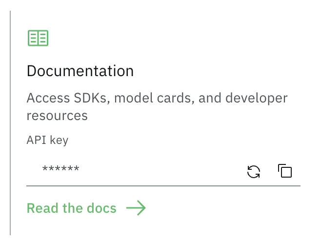
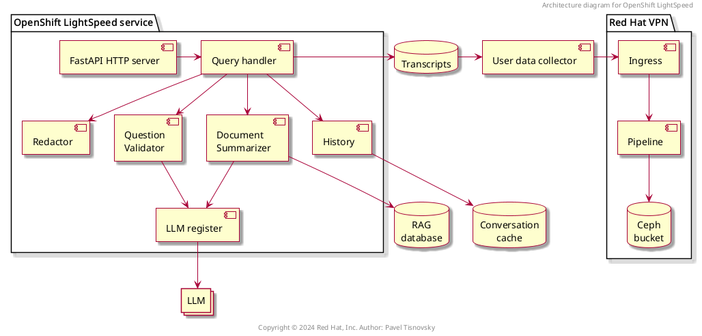
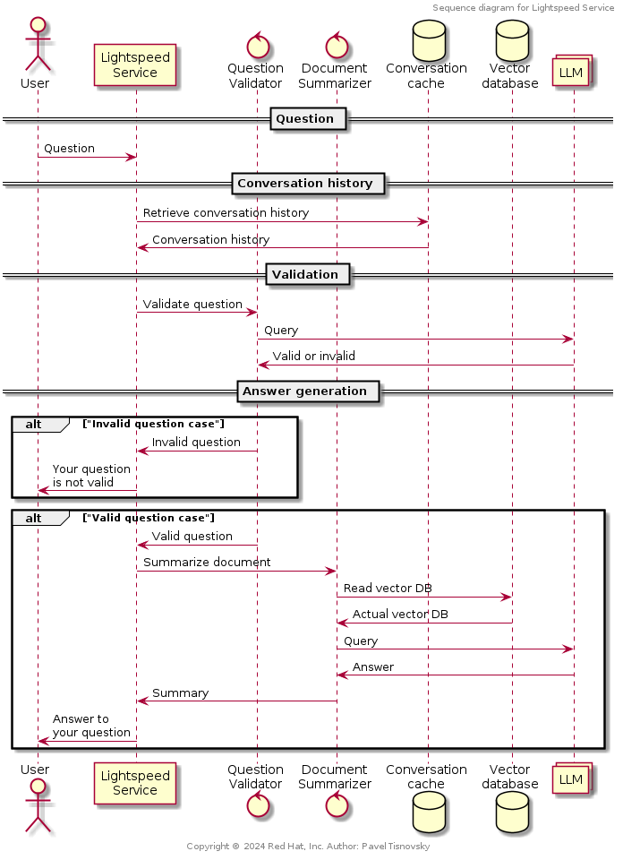
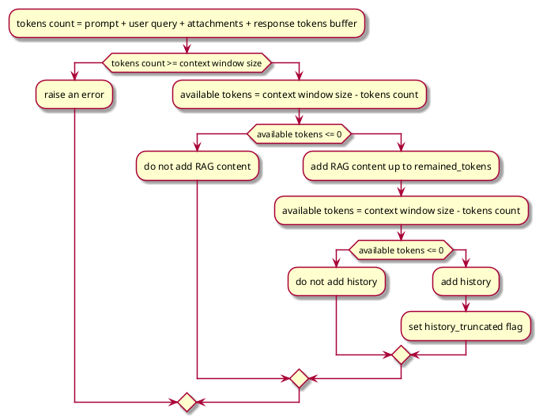

# About The Project

OpenShift LightSpeed (OLS) is an AI powered assistant that runs on OpenShift
and provides answers to product questions using backend LLM services. Currently
[OpenAI](https://openai.com/), [Azure
OpenAI](https://azure.microsoft.com/en-us/products/ai-services/openai-service),
[OpenShift
AI](https://www.redhat.com/en/technologies/cloud-computing/openshift/openshift-ai),
[RHEL
AI](https://www.redhat.com/en/technologies/linux-platforms/enterprise-linux/ai),
and [Watsonx](https://www.ibm.com/watsonx) are officially supported as
backends. Other providers, even ones that are not fully supported, can be used
as well. For example, it is possible to use BAM (IBM's research environment).
It is also possible to run [InstructLab](https://instructlab.ai/) locally,
configure model, and connect to it.


<!-- the following line is used by tool to autogenerate Table of Content when the document is changed -->
<!-- vim-markdown-toc GFM -->

* [Prerequisites](#prerequisites)
* [Installation](#installation)
    * [1. Clone the repo](#1-clone-the-repo)
    * [2. Install python packages](#2-install-python-packages)
    * [3. Get API keys](#3-get-api-keys)
        * [OpenAI](#openai)
        * [Azure OpenAI](#azure-openai)
        * [WatsonX](#watsonx)
        * [OpenShift AI](#openshift-ai)
        * [RHEL AI](#rhel-ai)
        * [BAM (not officially supported)](#bam-not-officially-supported)
        * [Locally running InstructLab](#locally-running-instructlab)
    * [4. Store local copies of API keys securely](#4-store-local-copies-of-api-keys-securely)
* [Configuration](#configuration)
    * [1. Configure OpenShift LightSpeed (OLS)](#1-configure-openshift-lightspeed-ols)
    * [2. Configure LLM providers](#2-configure-llm-providers)
        * [OpenAI provider](#openai-provider)
        * [Azure OpenAI](#azure-openai-1)
        * [WatsonX](#watsonx-1)
        * [RHEL AI provider](#rhel-ai-provider)
        * [Red Hat OpenShift AI](#red-hat-openshift-ai)
        * [Local *ollama* server](#local-ollama-server)
    * [3. Configure OLS Authentication](#3-configure-ols-authentication)
        * [3.1. K8S-based auth mechanism](#31-k8s-based-auth-mechanism)
        * [3.2. no-op auth mechanism](#32-no-op-auth-mechanism)
    * [4. Configure OLS TLS communication](#4-configure-ols-tls-communication)
    * [5. (Optional) Configure the local document store](#5-optional-configure-the-local-document-store)
    * [6. (Optional) Configure conversation cache](#6-optional-configure-conversation-cache)
    * [7. (Optional) Incorporating additional CA(s). You have the option to include an extra TLS certificate into the OLS trust store as follows.](#7-optional-incorporating-additional-cas-you-have-the-option-to-include-an-extra-tls-certificate-into-the-ols-trust-store-as-follows)
    * [8. (Optional) Configure the number of workers](#8-optional-configure-the-number-of-workers)
    * [9. Registering a new LLM provider](#9-registering-a-new-llm-provider)
    * [10. TLS security profiles](#10-tls-security-profiles)
    * [11. System prompt](#11-system-prompt)
    * [12. Quota limits](#12-quota-limits)
        * [Configuration format](#configuration-format)
        * [Tokens and token quota limits](#tokens-and-token-quota-limits)
    * [13. Configuration dump](#12-configuration-dump)
    * [14. Cluster introspection](#13-cluster-introspection)
* [Usage](#usage)
    * [Deployments](#deployments)
        * [Local Deployment](#local-deployment)
            * [Run the server](#run-the-server)
        * [Optionally run with podman](#optionally-run-with-podman)
        * [Optionally run inside an OpenShift environment](#optionally-run-inside-an-openshift-environment)
    * [Communication with the service](#communication-with-the-service)
        * [Query the server](#query-the-server)
        * [Validation if the logged-in user is authorized to access service](#validation-if-the-logged-in-user-is-authorized-to-access-service)
        * [Swagger UI](#swagger-ui)
        * [OpenAPI](#openapi)
        * [Metrics](#metrics)
        * [Gradio UI](#gradio-ui)
        * [Swagger UI](#swagger-ui-1)
        * [CPU profiling](#cpu-profiling)
        * [Memory profiling](#memory-profiling)
    * [Deploying OLS on OpenShift](#deploying-ols-on-openshift)
* [Project structure](#project-structure)
    * [Overall architecture](#overall-architecture)
        * [FastAPI server](#fastapi-server)
        * [Authorization checker](#authorization-checker)
        * [Query handler](#query-handler)
        * [Redactor](#redactor)
        * [Question validator](#question-validator)
        * [Document summarizer](#document-summarizer)
        * [Conversation history cache interface](#conversation-history-cache-interface)
        * [Conversation history cache implementations](#conversation-history-cache-implementations)
            * [In-memory cache](#in-memory-cache)
            * [Postgres cache](#postgres-cache)
        * [LLM providers registry](#llm-providers-registry)
        * [LLM providers interface implementations](#llm-providers-interface-implementations)
    * [Sequence diagram](#sequence-diagram)
    * [Token truncation algorithm](#token-truncation-algorithm)
* [New `pdm` commands available in project repository](#new-pdm-commands-available-in-project-repository)
* [Additional tools](#additional-tools)
    * [Utility to generate OpenAPI schema](#utility-to-generate-openapi-schema)
        * [Path](#path)
        * [Usage](#usage-1)
    * [Generating requirements.txt file](#generating-requirementstxt-file)
    * [Uploading artifact containing the pytest results and configuration to an s3 bucket.](#uploading-artifact-containing-the-pytest-results-and-configuration-to-an-s3-bucket)
        * [Path](#path-1)
        * [Usage](#usage-2)
* [Contributing](#contributing)
* [License](#license)

<!-- vim-markdown-toc -->


# Prerequisites

* Python 3.11 and Python 3.12
    - please note that currently Python 3.13 and Python 3.14 are not officially supported, because OLS LightSpeed depends on some packages that can not be used in this Python version
    - all sources are made (backward) compatible with Python 3.11; it is checked on CI
* Git, pip and [PDM](https://github.com/pdm-project/pdm?tab=readme-ov-file#installation)
* An LLM API key or API secret (in case of Azure OpenAI)
* (Optional) extra certificates to access LLM API

# Installation

## 1. Clone the repo
   ```sh
   git clone https://github.com/openshift/lightspeed-service.git
   cd lightspeed-service
   ```
## 2. Install python packages
   ```sh
   make install-deps
   ```
## 3. Get API keys

   This step depends on provider type

### OpenAI

Please look into ([OpenAI api key](https://platform.openai.com/api-keys))

### Azure OpenAI

Please look at following articles describing how to retrieve API key or secret from Azure: [Get subscription and tenant IDs in the Azure portal](https://learn.microsoft.com/en-us/azure/azure-portal/get-subscription-tenant-id) and [How to get client id and client secret in Azure Portal](https://azurelessons.com/how-to-get-client-id-and-client-secret-in-azure-portal/). Currently it is possible to use both ways to auth. to Azure OpenAI: by API key or by using secret

### WatsonX

Please look at into [Generating API keys for authentication](https://www.ibm.com/docs/en/watsonx/watsonxdata/1.0.x?topic=started-generating-api-keys)

### OpenShift AI

(TODO: to be updated)

### RHEL AI

(TODO: to be updated)

### BAM (not officially supported)
    1. Get a BAM API Key at [https://bam.res.ibm.com](https://bam.res.ibm.com)
        * Login with your IBM W3 Id credentials.
        * Copy the API Key from the Documentation section.
        
    2. BAM API URL: https://bam-api.res.ibm.com

### Locally running InstructLab

Depends on configuration, but usually it is not needed to generate or use API key.


## 4. Store local copies of API keys securely

   Here is a proposed scheme for storing API keys on your development workstation. It is similar to how private keys are stored for OpenSSH.
   It keeps copies of files containing API keys from getting scattered around and forgotten:

   ```
   $ cd <lightspeed-service local git repo root>
   $ find ~/.openai -ls
   72906922      0 drwx------   1 username username        6 Feb  6 16:45 /home/username/.openai
   72906953      4 -rw-------   1 username username       52 Feb  6 16:45 /home/username/.openai/key
   $ ls -l openai_api_key.txt
   lrwxrwxrwx. 1 username username 26 Feb  6 17:41 openai_api_key.txt -> /home/username/.openai/key
   $ grep openai_api_key.txt olsconfig.yaml
    credentials_path: openai_api_key.txt
   ```

# Configuration

## 1. Configure OpenShift LightSpeed (OLS)

   OLS configuration is in YAML format. It is loaded from a file referred to by the `OLS_CONFIG_FILE` environment variable and defaults to `olsconfig.yaml` in the current directory.
   You can find a example configuration in the [examples/olsconfig.yaml](examples/olsconfig.yaml) file in this repository.

## 2. Configure LLM providers

   The example configuration file defines providers for six LLM providers: BAM, OpenAI, Azure OpenAI, Watsonx, OpenShift AI VLLM (RHOAI VLLM), and RHELAI (RHEL AI), but defines BAM as the default provider. If you prefer to use a different LLM provider than BAM, such as OpenAI, ensure that the provider definition points to a file containing a valid OpenAI, Watsonx etc. API key, and change the `default_model` and `default_provider` values to reference the selected provider and model.

   The example configuration also defines locally running provider InstructLab which is OpenAI-compatible and can use
   several models. Please look at [instructlab pages](https://github.com/instructlab/instructlab/tree/main) for detailed
   information on how to set up and run this provider.

   API credentials are in turn loaded from files specified in the config YAML by the `credentials_path` attributes. If these paths are relative,
   they are relative to the current working directory. To use the example olsconfig.yaml as is, place your BAM API Key into a file named `bam_api_key.txt` in your working directory.

   [!NOTE]
   There are two supported methods to provide credentials for Azure OpenAI. The first method is compatible with other providers, i.e. `credentials_path` contains a directory name containing one file with API token. In the second method, that directory should contain three files named `tenant_id`, `client_id`, and `client_secret`. Please look at following articles describing how to retrieve this information from Azure: [Get subscription and tenant IDs in the Azure portal](https://learn.microsoft.com/en-us/azure/azure-portal/get-subscription-tenant-id) and [How to get client id and client secret in Azure Portal](https://azurelessons.com/how-to-get-client-id-and-client-secret-in-azure-portal/).

### OpenAI provider

   Multiple models can be configured, but `default_model` will be used, unless specified differently via REST API request:


  ```yaml
    type: openai
    url: "https://api.openai.com/v1"
    credentials_path: openai_api_key.txt
    models:
      - name: <model 1>
      - name: <model 2>
  ```

### Azure OpenAI

   Make sure the `url` and `deployment_name` are set correctly.

  ```yaml
  - name: my_azure_openai
    type: azure_openai
    url: "https://myendpoint.openai.azure.com/"
    credentials_path: azure_openai_api_key.txt
    deployment_name: my_azure_openai_deployment_name
    models:
      - name: <model name>
  ```

### WatsonX

   Make sure the `project_id` is set up correctly.

  ```yaml
  - name: my_watsonx
    type: watsonx
    url: "https://us-south.ml.cloud.ibm.com"
    credentials_path: watsonx_api_key.txt
    project_id: XXXXXXXX-XXXX-XXXX-XXXX-XXXXXXXXXXXX
    models:
      - name: <model name>
  ```

### RHEL AI provider

   It is possible to use RHELAI as a provider too. That provider is OpenAI-compatible
   and can be configured the same way as other OpenAI providers. For example if
   RHEL AI is running as EC2 instance and `granite-7b-lab` model is deployed, the
   configuration might look like:

  ```yaml
      - name: my_rhelai
        type: openai
        url: "http://{PATH}.amazonaws.com:8000/v1/"
        credentials_path: openai_api_key.txt
        models:
          - name: <model name>
  ```

### Red Hat OpenShift AI

   To use RHOAI (Red Hat OpenShiftAI) as provider, the following
   configuration can be utilized (`mistral-7b-instruct` model is supported by
   RHOAI, as well as other models):

  ```yaml
      - name: my_rhoai
        type: openai
        url: "http://{PATH}:8000/v1/"
        credentials_path: openai_api_key.txt
        models:
          - name: <model name>
  ```

### Local *ollama* server

   It is possible to configure the service to use local *ollama* server.
   Please look into an
   [examples/olsconfig-local-ollama.yaml](examples/olsconfig-local-ollama.yaml)
   file that describes all required steps.

   1. Common providers configuration options

       - `name`: unique name, can be any proper YAML literal
       - `type`: provider type: any of `bam`, `openai`, `azure_openai`, `rhoai_vllm`, `rhelai_vllm`, or `watsonx`
       - `url`: URL to be used to call LLM via REST API
       - `api_key`: path to secret (token) used to call LLM via REST API
       - `models`: list of models configuration (model name + model-specific parameters)

            Notes: 
            - `Context window size` varies based on provider/model.
            - `Max response tokens` depends on user need and should be in reasonable proportion to context window size. If value is too less then there is a risk of response truncation. If we set it too high then we will reserve too much for response & truncate history/rag context unnecessarily.
            - These are optional setting, if not set; then default will be used (which may be incorrect and may cause truncation & potentially error by exceeding context window).

   2. Specific configuration options for WatsonX

       - `project_id`: as specified on WatsonX AI page

   3. Specific configuration options for Azure OpenAI

       - `api_version`: as specified in official documentation, if not set; by default `2024-02-15-preview` is used.
       - `deployment_name`: as specified in AzureAI project settings

   4. Default provider and default model
       - one provider and its model needs to be selected as default. When no
         provider+model is specified in REST API calls, the default provider and model are used:

         ```yaml
            ols_config:
              default_provider: <provider name>
              default_model: <model name>
         ```


## 3. Configure OLS Authentication

   [!NOTE]
   Currently, only K8S-based authentication and the so called no-op authentication can be used. It is possible to configure which mechanism should be used. The K8S-based authentication is selected by default if the auth. method is not specified in configuration.

### 3.1. K8S-based auth mechanism

   This section provides guidance on how to configure authentication based on K8S within OLS. It includes instructions on enabling or disabling authentication, configuring authentication through OCP RBAC, overriding authentication configurations, and specifying a static authentication token in development environments.

   1. Enabling and Disabling Authentication
   
      Authentication is enabled by default in OLS. To disable authentication, modify the `dev_config` in your configuration file as shown below:

      ```yaml
         dev_config:
            disable_auth: true
      ```

   2. Configuring Authentication with OCP RBAC

      OLS utilizes OCP RBAC for authentication, necessitating connectivity to an OCP cluster. It automatically selects the configuration from the first available source, either an in-cluster configuration or a KubeConfig file.

   3. Overriding Authentication Configuration

      You can customize the authentication configuration by overriding the default settings. The configurable options include:

      - **Kubernetes Cluster API URL (`k8s_cluster_api`):** The URL of the K8S/OCP API server where tokens are validated.
      - **CA Certificate Path (`k8s_ca_cert_path`):** Path to a CA certificate for clusters with self-signed certificates.
      - **Skip TLS Verification (`skip_tls_verification`):** If true, the Kubernetes client skips TLS certificate validation for the OCP cluster.

      To apply any of these overrides, update your configuration file as follows:

      ```yaml
         ols_config:
            authentication_config:
               k8s_cluster_api: "https://api.example.com:6443"
               k8s_ca_cert_path: "/Users/home/ca.crt"
               skip_tls_verification: false
      ```

   4. Providing a Static Authentication Token in Development Environments

      For development environments, you may wish to use a static token for authentication purposes. This can be configured in the `dev_config` section of your configuration file:

      ```yaml
         dev_config:
            k8s_auth_token: your-user-token
      ```
      **Note:** using static token will require you to set the `k8s_cluster_api` mentioned in section 6.4, as this will disable the loading of OCP config from in-cluster/kubeconfig.

   
### 3.2. no-op auth mechanism

      This auth mechanism can be selected by the following configuration parameter:

      ```yaml
         ols_config:
            authentication_config:
              module: "noop"
      ```

      In this case it is possible to pass `user-id` optional when calling REST API query endpoints. If the `user-id` won't be passed, the default one will be used: `00000000-0000-0000-0000-000000000000`

## 4. Configure OLS TLS communication

   This section provides instructions on configuring TLS (Transport Layer Security) for the OLS Application, enabling secure connections via HTTPS. TLS is enabled by default; however, if necessary, it can be disabled through the `dev_config` settings.


   1. Enabling and Disabling TLS
   
      By default, TLS is enabled in OLS. To disable TLS, adjust the `dev_config` in your configuration file as shown below:

      ```yaml
         dev_config:
            disable_tls: false
      ```

   2. Configuring TLS in local Environments:

      1. Generate Self-Signed Certificates: To generate self-signed certificates, run the following command from the project's root directory:
         ```bash
            ./scripts/generate-certs.sh
         ``` 
      2. Update OLS Configuration: Modify your config.yaml to include paths to your certificate and its private key:
         ```yaml
            ols_config:
               tls_config:
                  tls_certificate_path: /full/path/to/certs/cert.pem
                  tls_key_path: /full/path/to/certs/key.pem
         ```
      3. Launch OLS with HTTPS: After applying the above configurations, OLS will run over HTTPS.
   
   3. Configuring OLS in OpenShift:

      For deploying in OpenShift, Service-Served Certificates can be utilized. Update your ols-config.yaml as shown below, based on the example provided in the examples directory:

      ```yaml
         ols_config:
            tls_config:
               tls_certificate_path: /app-root/certs/cert.pem
               tls_key_path: /app-root/certs/key.pem
      ```
   4. Using a Private Key with a Password
      If your private key is encrypted with a password, specify a path to a file that contains the key password as follows:
      ```yaml
         ols_config:
            tls_config:
               tls_key_password_path: /app-root/certs/password.txt
      ```

## 5. (Optional) Configure the local document store

   The following command downloads a copy of the whole image containing RAG embedding model and vector database:

   ```sh
   make get-rag
   ```

   Please note that the link to the specific image to be downloaded is stored in the file `build.args` (and that file is autoupdated by bots when new a RAG is re-generated):

## 6. (Optional) Configure conversation cache
   Conversation cache can be stored in memory (it's content will be lost after shutdown) or in PostgreSQL database. It is possible to specify storage type in `olsconfig.yaml` configuration file.
   
   1. Cache stored in memory:
         ```yaml
         ols_config:
            conversation_cache:
               type: memory
               memory:
               max_entries: 1000
         ```
   2. Cache stored in PostgreSQL:
         ```yaml
         conversation_cache:
            type: postgres
            postgres:
               host: "foobar.com"
               port: "1234"
               dbname: "test"
               user: "user"
               password_path: postgres_password.txt
               ca_cert_path: postgres_cert.crt
               ssl_mode: "require"
         ```
         In this case, file `postgres_password.txt` contains password required to connect to PostgreSQL. Also CA certificate can be specified using `postgres_ca_cert.crt` to verify trusted TLS connection with the server. All these files needs to be accessible. 

## 7. (Optional) Incorporating additional CA(s). You have the option to include an extra TLS certificate into the OLS trust store as follows.
```yaml
      ols_config:
         extra_ca:
            - "path/to/cert_1.crt"
            - "path/to/cert_2.crt"
```

 > This action may be required for self-hosted LLMs.

## 8. (Optional) Configure the number of workers
   By default the number of workers is set to 1, you can increase the number of workers to scale up the REST API by modifying the max_workers config option in `olsconfig.yaml`.
   ```yaml
         ols_config:
           max_workers: 4
   ```

## 9. Registering a new LLM provider
   Please look [here](https://github.com/openshift/lightspeed-service/blob/main/CONTRIBUTING.md#adding-a-new-providermodel) for more info.

## 10. TLS security profiles
   TLS security profile can be set for the service itself and also for any configured provider. To specify TLS security profile for the service, the following section can be added into `ols` section in the `olsconfig.yaml` configuration file:

```
  tlsSecurityProfile:
    type: OldType
    ciphers:
        - TLS_ECDHE_RSA_WITH_AES_128_GCM_SHA256
        - TLS_ECDHE_RSA_WITH_AES_256_GCM_SHA384
    minTLSVersion: VersionTLS13
```

- `type` can be set to: OldType, IntermediateType, ModernType, or Custom
- `minTLSVersion` can be set to: VersionTLS10, VersionTLS11, VersionTLS12, or VersionTLS13
- `ciphers` is list of enabled ciphers. The values are not checked.

Please look into `examples` folder that contains `olsconfig.yaml` with filled-in TLS security profile for the service.
Additionally the TLS security profile can be set for any configured provider. In this case the `tlsSecurityProfile` needs to be added into the `olsconfig.yaml` file into `llm_providers/{selected_provider}` section. For example:

```
llm_providers:
  - name: my_openai
    type: openai
    url: "https://api.openai.com/v1"
    credentials_path: openai_api_key.txt
    models:
      - name: model-name-1
      - name: model-name-2
    tlsSecurityProfile:
      type: Custom
      ciphers:
          - TLS_ECDHE_RSA_WITH_AES_128_GCM_SHA256
          - TLS_ECDHE_RSA_WITH_AES_256_GCM_SHA384
      minTLSVersion: VersionTLS13
```

[!NOTE]
The `tlsSecurityProfile` is fully optional. When it is not specified, the LLM call won't be affected by specific SSL/TLS settings.


## 11. System prompt
   The service uses the, so called, system prompt to put the question into context before the question is sent to the selected LLM. The default system prompt is designed for questions about OpenShift and Kubernetes. It is possible to use a different system prompt via the configuration option `system_prompt_path` in the `ols_config` section. That option must contain the path to the text file with the actual system prompt (can contain multiple lines). An example of such configuration:

```yaml
ols_config:
  system_prompt_path: "system_prompts/system_prompt_for_product_XYZZY"
```

Additionally an optional string parameter `system_prompt` can be specified in `/v1/query` endpoint to override the configured system prompt. This override mechanism can be used only when the `dev_config.enable_system_prompt_override` configuration options is set to `true` in the service configuration file. Please note that the default value for this option is `false`, so the system prompt cannot be changed. This means, when the `dev_config.enable_system_prompt_override` is set to `false` and `/v1/query` is invoked with the `system_prompt` parameter, the value specified in `system_prompt` parameter is ignored.


## 12. Quota limits


### Tokens and token quota limits

Tokens are small chunks of text, which can be as small as one character or as large as one word. Tokens are the units of measurement used to quantify the amount of text that the service sends to, or receives from, a large language model (LLM). Every interaction with the Service and the LLM is counted in tokens.

LLM providers typically charge for their services using a token-based pricing model.

Token quota limits define the number of tokens that can be used in a certain timeframe. Implementing token quota limits helps control costs, encourage more efficient use of queries, and regulate demand on the system. In a multi-user configuration, token quota limits help provide equal access to all users ensuring everyone has an opportunity to submit queries.

### Quota limiter features

It is possible to limit quota usage per user or per service or services (that typically run in one cluster). Each limit is configured as a separate _quota limiter_. It can be of type `user_limiter` or `cluster_limiter` (which is name that makes sense in OpenShift deployment). There are three configuration options for each limiter:

1. `period` specified in a human-readable form, see https://www.postgresql.org/docs/current/datatype-datetime.html#DATATYPE-INTERVAL-INPUT for all possible options. When the end of the period is reached, quota is reset or increased
1. `initial_quota` is set at beginning of the period
1. `quota_increase` alternatively it is possible to increase quota when period is reached

Please note that any number of quota limiters can be configured. For example, two user quota limiters can be set to:
- increase quota by 100,000 tokens each day
- reset quota to 10,000,000 tokens each month

### Configuration format

Activate token quota limits for the service by adding a new configuration structure into the configuration file. That structure should be added into `ols_config` section. It has the following format:


```
  quota_handlers: 
    storage:
      host: <IP_address> <1>
      port: "5432" <2>
      dbname: <database_name>
      user: <user_name>
      password_path: <file_containing_database_password>
      ssl_mode: disable
    limiters:
      - name: user_monthly_limits
        type: user_limiter
        initial_quota: 100000 <3>
        quota_increase: 10 <4>
        period: 30 days
      - name: cluster_monthly_limits
        type: cluster_limiter
        initial_quota: 100000 <3>
        quota_increase: 1000000 <4>
        period: 30 days
    scheduler:
      period: 300 <5>
```

<1> Specifies the IP address for the PostgresSQL database. \
<2> Specifies the port for PostgresSQL database. Default port is 5432. \
<3> Specifies a token quota limit of 100,000 for each user over a period of 30 days. \
<4> Increases the token quota limit for the cluster by 100,000 over a period of 30 days. \
<5> Defines the number of seconds that the scheduler waits and then checks if the period interval is over. When the period interval is over, the scheduler stores the timestamp and resets or increases the quota limit. 300 seconds or even 600 seconds are good values.


## 13. Configuration dump

It is possible to dump the actual configuration into a JSON file for further processing. The generated configuration file will contain all the configuration attributes, including keys etc., so keep the output file in a secret.

In order to dump the configuration, pass `--dump-config` command line option.

## 14. Cluster introspection

> **⚠ Warning:** This feature is experimental and currently under development.

OLS can gather real-time information from your cluster to assist with specific queries. You can enable this feature by adding the following configuration:
```yaml
ols_config:
  introspection_enabled: true
```
OLS utilizes tools based on the oc CLI to collect relevant cluster context. The following safeguards are in place:
- Tools operate in read-only mode—they can retrieve data but cannot modify the cluster.
- Tools run using only the user's token (from the request). If the user lacks the necessary permissions, tool outputs may include permission errors.


# Usage

## Deployments

### Local Deployment

OLS service can be started locally. In this case GradIO web UI is used to
interact with the service. Alternatively the service can be accessed through
REST API.

[!TIP]
To enable GradIO web UI you need to have the following `dev_config` section in your configuration file:

```yaml
dev_config:
  enable_dev_ui: true
  ...
  ...
  ...
```


#### Run the server

If Python virtual environment is setup already, it is possible to start the service by following command:

```sh
make run
```

It is also possible to initialize virtual environment and start the service by using just one command:

```sh
pdm start
```


### Optionally run with podman
There is an all-in-one image that has the document store included already.

1. Follow steps above to create your config yaml and your API key file(s). 
1. Place your config yaml and your API key file(s) in a known location (eg:
`/path/to/config`)
1. Make sure your config yaml references the config folder for the path to your
key file(s) (eg: `credentials_path: config/openai_api_key.txt`)
1. Run the all-in-one-container. Example invocation:

   ```sh
    podman run -it --rm -v `/path/to/config:/app-root/config:Z \
    -e OLS_CONFIG_FILE=/app-root/config/olsconfig.yaml -p 8080:8080 \
    quay.io/openshift-lightspeed/lightspeed-service-api:latest
    ```

### Optionally run inside an OpenShift environment
In the `examples` folder is a set of YAML manifests,
`openshift-lightspeed.yaml`. This includes all the resources necessary to get
OpenShift Lightspeed running in a cluster. It is configured expecting to only
use OpenAI as the inference endpoint, but you can easily modify these manifests,
looking at the `olsconfig.yaml` to see how to alter it to work with BAM as the
provider.

There is a commented-out OpenShift Route with TLS Edge termination available if
you wish to use it.

To deploy, assuming you already have an OpenShift environment to target and that
you are logged in with sufficient permissions:

1. Make the change to your API keys and/or provider configuration in the
manifest file
2. Create a namespace/project to hold OLS
3. `oc apply -f examples/openshift-lightspeed-tls.yaml -n created-namespace`

Once deployed, it is probably easiest to `oc port-forward` into the pod where
OLS is running so that you can access it from your local machine.


## Communication with the service

### Query the server

To send a request to the server you can use the following curl command:
```sh
curl -X 'POST' 'http://127.0.0.1:8080/v1/query' -H 'accept: application/json' -H 'Content-Type: application/json' -d '{"query": "write a deployment yaml for the mongodb image"}'
```

> You can use the `/v1/streaming_query` (with the same parameters) to get the streaming response (SSE/HTTP chunking). By default, it streams text, but you can also yield events as JSONs via additional `"media_type": "application/json"` parameter in the payload data.

> The format of individual events is `"data: {JSON}\n\n"`.

> In the devel environment where authentication module is set to `noop` it is possible to specify an optional query parameter `user_id` with the user identification. This parameter can be set to any value, but currently it is preferred to use UUID.


### Validation if the logged-in user is authorized to access service

To validate if the logged-in user is authorized to access the service, the following REST API call can be utilized:

```sh
curl -X 'POST' 'http://localhost:8080/authorized' -H 'accept: application/json'
```

For authorized users, 200 OK is returned, otherwise `401 Missing or invalid credentials provided by client` or `403 User is not authorized` HTTP codes can be returned.

> In the devel environment where authentication module is set to `noop` it is possible to specify an optional query parameter `user_id` with the user identification. This parameter can be set to any value, but currently it is preferred to use UUID.


### Swagger UI

Web page with Swagger UI has the standard `/docs` endpoint. If the service is running on localhost on port 8080, Swagger UI can be accessed on the address `http://localhost:8080/docs`.

It is also possible to access Redoc page with three-panel, responsive layout. This page uses `/redoc` endpoint. Again, if the service is running on localhost on port 8080, Redoc UI can be accessed on the address `http://localhost:8080/redoc`.


### OpenAPI

OpenAPI schema is available [docs/openapi.json](docs/openapi.json). It is possible to re-generate the document with schema by using:

```
make schema
```

When the OLS service is started OpenAPI schema is available on `/openapi.json` endpoint. For example, for service running on localhost on port 8080, it can be accessed and pretty printed by using following command:

```sh
curl 'http://127.0.0.1:8080/openapi.json' | jq .
```


### Metrics

Service exposes metrics in Prometheus format on `/metrics` endpoint. Scraping them is straightforward:

```sh
curl 'http://127.0.0.1:8080/metrics'
```

### Gradio UI

There is a minimal Gradio UI you can use when running the OLS server locally.  To use it, it is needed to enable UI in `olsconfig.yaml` file:

```yaml
dev_config:
  enable_dev_ui: true
```

Then start the OLS server per [Run the server](#run-the-server) and then browse to the built in Gradio interface at http://localhost:8080/ui

By default this interface will ask the OLS server to retain and use your conversation history for subsequent interactions.  To disable this behavior, expand the `Additional Inputs` configuration at the bottom of the page and uncheck the `Use history` checkbox.  When not using history each message you submit to OLS will be treated independently with no context of previous interactions.

###  Swagger UI

OLS API documentation is available at http://localhost:8080/docs

###  CPU profiling
To enable CPU profiling, please deploy your own pyroscope server and specify its URL in the `devconfig` as shown below. This will help OLS to send profiles to a specified endpoint.

```yaml
dev_config:
  pyroscope_url: https://your-pyroscope-url.com
```

### Memory profiling
To enable memory profiling, simply start the server with the below command.
```
make memray-run
```
Once you are done executing a few queries and want to look at the memory flamegraphs, please run the below command and it should spit out a html file for us.
```
make memray-flamegraph
```

## Deploying OLS on OpenShift

A Helm chart is available for installing the service in OpenShift.

Before installing the chart, you must configure the `auth.key` parameter in the [Values](helm/values.yaml) file

To install the chart with the release name `ols-release` in the namespace `openshift-lightspeed`:

```shell
helm upgrade --install ols-release helm/ --create-namespace --namespace openshift-lightspeed
```

The command deploys the service in the default configuration.

The default configuration contains OLS fronting with a [kube-rbac-proxy](https://github.com/brancz/kube-rbac-proxy).

To uninstall/delete the chart with the release name `ols-release`:

```shell
helm delete ols-release --namespace openshift-lightspeed
```

Chart customization is available using the [Values](helm/values.yaml) file.


# Project structure

1. REST API handlers
1. Configuration loader
1. LLM providers registry
1. LLM loader
1. Interface to LLM providers
1. Doc retriever from vector storage
1. Question validator
1. Docs summarizer
1. Conversation cache
1. (Local) Web-based user interface


## Overall architecture

Overall architecture with all main parts is displayed below:



OpenShift LightSpeed service is based on the FastAPI framework (Uvicorn) with Langchain for LLM interactions. The service is split into several parts described below.

### FastAPI server

Handles REST API requests from clients (mainly from UI console, but can be any REST API-compatible tool), handles requests queue, and also exports Prometheus metrics. The Uvicorn framework is used as a FastAPI implementation.

### Authorization checker

Manages authentication flow for REST API endpoints. Currently K8S/OCL-based authorization or no-op authorization can be used. The selection of authorization mechanism can be done via configuration file.

### Query handler

Retrieves user queries, validates them, redacts them, calls LLM, and summarizes feedback.

### Redactor

Redacts the question based on the regex filters provided in the configuration file.

### Question validator

Validates questions and provides one-word responses. It is an optional component.

### Document summarizer

Summarizes documentation context.

### Conversation history cache interface

Unified interface used to store and retrieve conversation history with optionally defined maximum length.

### Conversation history cache implementations

Currently there exist two conversation history cache implementations:
1. in-memory cache
1. Postgres cache

Entries stored in cache have compound keys that consist of `user_id` and `conversation_id`. It is possible for one user to have multiple conversations and thus multiple `conversation_id` values at the same time. Global cache capacity can be specified. The capacity is measured as the number of entries; entries sizes are ignored in this computation.

#### In-memory cache

In-memory cache is implemented as a queue with a defined maximum capacity specified as the number of entries that can be stored in a cache. That number is the limit for all cache entries, it doesn't matter how many users are using the LLM. When the new entry is put into the cache and if the maximum capacity is reached, the oldest entry is removed from the cache.

#### Postgres cache

Entries are stored in one Postgres table with the following schema:

```
     Column      |            Type             | Nullable | Default | Storage  |
-----------------+-----------------------------+----------+---------+----------+
 user_id         | text                        | not null |         | extended |
 conversation_id | text                        | not null |         | extended |
 value           | bytea                       |          |         | extended |
 updated_at      | timestamp without time zone |          |         | plain    |
Indexes:
    "cache_pkey" PRIMARY KEY, btree (user_id, conversation_id)
    "cache_key_key" UNIQUE CONSTRAINT, btree (key)
    "timestamps" btree (updated_at)
Access method: heap
```

During a new record insertion the maximum number of entries is checked and when the defined capacity is reached, the oldest entry is deleted.


### LLM providers registry

Manages LLM providers implementations. If a new LLM provider type needs to be added, it is registered by this machinery and its libraries are loaded to be used later.

### LLM providers interface implementations

Currently there exist the following LLM providers implementations:
1. OpenAI
1. Azure OpenAI
1. RHEL AI
1. OpenShift AI
1. WatsonX
1. BAM
1. Fake provider (to be used by tests and benchmarks)


## Sequence diagram

Sequence of operations performed when user asks a question:




## Token truncation algorithm

The context window size is limited for all supported LLMs which means that token truncation algorithm needs to be performed for longer queries, queries with long conversation history etc. Current truncation logic/context window token check:

1. Tokens for current prompt system instruction + user query + attachment (if any) + tokens reserved for response (default 512) should not be greater than model context window size, otherwise OLS will raise an error.
1. Let’s say above tokens count as default tokens that will be used all the time. If any token is left after default usage then RAG context will be used completely or truncated depending upon how much tokens are left.
1. Finally if we have further available tokens after using complete RAG context, then history will be used (or will be truncated)
1. There is a flag set to True by the service, if history is truncated due to tokens limitation.




# New `pdm` commands available in project repository

```
╭───────────────────────────────────┬──────┬────────────────────────────────────────────────╮
│ Name                              │ Type │ Description                                    │
├───────────────────────────────────┼──────┼────────────────────────────────────────────────┤
│ benchmarks                        │ cmd  │ pdm run make benchmarks                        │
│ check-types                       │ cmd  │ pdm run make check-types                       │
│ coverage-report                   │ cmd  │ pdm run make coverage-report                   │
│ generate-schema                   │ cmd  │ pdm run make schema                            │
│ integration-tests-coverage-report │ cmd  │ pdm run make integration-tests-coverage-report │
│ requirements                      │ cmd  │ pdm run make requirements.txt                  │
│ security-check                    │ cmd  │ pdm run make security-check                    │
│ start                             │ cmd  │ pdm run make run                               │
│ test                              │ cmd  │ pdm run make test                              │
│ test-e2e                          │ cmd  │ pdm run make test-e2e                          │
│ test-integration                  │ cmd  │ pdm run make test-integration                  │
│ test-unit                         │ cmd  │ pdm run make test-unit                         │
│ unit-tests-coverage-report        │ cmd  │ pdm run make unit-tests-coverage-report        │
│ verify-packages                   │ cmd  │ pdm run make verify-packages-completeness      │
│ verify-sources                    │ cmd  │ pdm run make verify                            │
│ version                           │ cmd  │ pdm run make print-version                     │
╰───────────────────────────────────┴──────┴────────────────────────────────────────────────╯
```

# Additional tools

## Utility to generate OpenAPI schema

This script re-generated OpenAPI schema for the Lightspeed Service REST API.

### Path

[scripts/generate_openapi_schema.py](scripts/generate_openapi_schema.py)

### Usage

```
pdm generate-schema
```

## Generating requirements.txt file

For Konflux hermetic builds, Cachi2 uses the `requirements.txt` format to generate a list of packages to prefetch.  

To generate the `requirements.txt` file, follow these steps:  

1. Run `pdm update` – updates dependencies to their latest versions allowed by our `pyproject.toml` pins, this also creates/updates a `pdm.lock`.
2. Run `make requirements.txt` – generates the `requirements.txt` (contains wheel for all platforms/archs).


## Uploading artifact containing the pytest results and configuration to an s3 bucket.

### Path

[scripts/upload_artifact_s3.py](scripts/upload_artifact_s3.py)

### Usage

A dictionary containing the credentials of the S3 bucket must be specified, containing the keys:
- `AWS_BUCKET`
- `AWS_REGION`
- `AWS_ACCESS_KEY_ID`
- `AWS_SECRET_ACCESS_KEY`


# Contributing

* See [contributors](CONTRIBUTING.md) guide.

* See the [open issues](https://github.com/openshift/lightspeed-service/issues) for a full list of proposed features (and known issues).

# License
Published under the Apache 2.0 License
