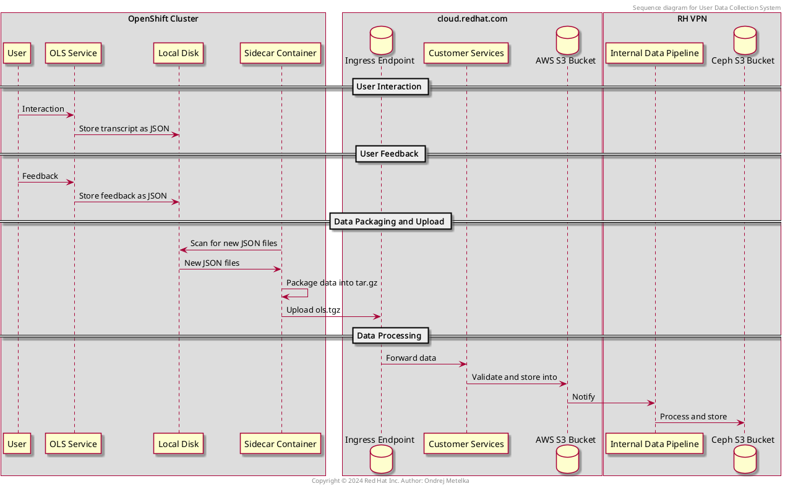

# OLS user data collection

## Overview
This document outlines the process of capturing user interactions and system responses in the OpenShift LightSpeed service (OLS). Understanding this process will help optimize the system for better responses and outcomes.

## Components
### OLS
- Every user interaction results in the storage of its transcript as a JSON file on the local disk.
- When a user provides feedback (whether the OLS answer was satisfactory or not), the data is posted to the `/feedback` endpoint. This action also results in the creation of a JSON file.

### Sidecar
- Alongside the main application (OLS service), a sidecar container is deployed.
- This sidecar container periodically scans the relevant disk location for new JSON files (transcripts and feedback).
- It packages these data into a tar.gz archive and uploads it to console.redhat.com (ingress).

### console.redhat.com - Ingress
- Responsible for accepting payload (our archive), storing into internal AWS S3 Bucket (unreachable for us) and notifying relevant postprocessing (ccx pipeline)

    > We have a special User-Agent: `openshift-lightspeed-operator/user-data-collection cluster/{cluster_id}`

### Observability (CCX) internal-data-pipeline
- Is notified about the new incoming OLS archive.
- It will copy the archive from the internal AWS S3 Bucket to its equivalent in DataHub's Ceph S3 Bucket - in our bucket/bucket we can access.
- The storage pattern for new archives inside a bucket is as follow:
    ```
    <BUCKET>/archives/compressed/<first two chars from cluster ID>/<cluster ID>/<YYYYMM>/<DD>/<HHMMSS>.tar.gz
    ```
    > Timestamp part is the timestamp of when the archive was processed by this pipeline.

## Ceph Buckets

This is the list of our buckets in the Ceph S3 (https://s3.upshift.redhat.com)
- PROD-OLS-ARCHIVES
- QA-OLS-ARCHIVES

Bucket access management is done via this repository https://gitlab.cee.redhat.com/jsegural/s3-bucket-management/-/blob/main/buckets.yaml?ref_type=heads

## Secrets
The only secret required in this entire process is the one used to authenticate POST requests to console.redhat.com (ingress). There are several methods to obtain this secret:

1. Using the Cluster Secret: In the production environment or in-cluster, the "pull-secret" from the "openshift-config" namespace is used. This secret can be found in the `.dockerconfigjson` under `auths/cloud.openshift.com/auth`.

    > The Insights Operator also uses this same secret for its own authentication to Ingress.

2. Using an Access Token: Another method is to use an access token. To generate an access token, you first need to generate an "offline" token. This can be done at the following locations:

    - For production: https://access.redhat.com/management/api
    - For staging: https://access.stage.redhat.com/management/api

    Once you have an "offline token", you can provide it to the data collection script via `olsconfig.yaml`, eg.
    ```yaml
    user_data_collector_config:
        cp_offline_token: fake_token
        ...
    ...
    ```
    The script will then generate an "access token" for you on-the-fly.

3. Direct POSTs to Ingress: If you want to make direct POST requests to the Ingress, you will need an "access token". To get this, you need to have the "offline token" and follow the instructions provided here. Please note that the URL you use to generate the token will differ based on the environment:

For production: https://sso.redhat.com
For staging: https://sso.stage.redhat.com

> In CI, we are proving in `cp_offline_token` which was manually generated via https://access.redhat.com/management/api and stored into our secrets/vault.

## Data flow diagram



## How to test locally
To test locally, use or tweak this configuration from `olsconfig.yaml`:
```yaml
# rest of the olsconfig.yaml
user_data_collector_config:
  data_storage: "some/path"
  log_level: debug
  collection_interval: 10  # seconds
  run_without_initial_wait: true
  ingress_env: stage
  cp_offline_token: token
```

- `data_storage`: Absolute path of directory containing /transcripts and/or /feedback with data.
- `run_without_initial_wait`: Set to `true` to avoid waiting before collection (default is 5 minutes).
- `cp_offline_token`: Offline token generated for the environment you desire.

If you don't want to create the data manually, you can use OLS service to do it for you (as it does in production). You need relevant config entry
```yaml
ols_config:
  user_data_collection:
    feedback_disabled: false
    feedback_storage: "/your-path/user-data/feedback"
    transcripts_disabled: false
    transcripts_storage: "/your-path/user-data/transcripts"
    config_disabled: false
    config_storage: "/your-path/user-data/config"
```

> `/feedback`, `/transcripts` and `/config` needs to be under the same directory - `user-data/` in example above

and then just interact with OLS, post feedback or ask a question - it will store the data/JSONs under specified location.

Then, you can run `<envs as above> python ols/user_data_collection/data_collector.py` 

You should see output similar to this
```bash
[2024-05-28 12:20:58,685] INFO: collected 2 files (splitted to 1 chunks) from '/app-root/ols-user-data'
[2024-05-28 12:20:58,686] DEBUG: collected files: [<list of files>]
[2024-05-28 12:20:58,686] INFO: uploading data chunk 1/1
[2024-05-28 12:20:58,690] INFO: sending collected data
[2024-05-28 12:20:58,690] DEBUG: using CP offline token to generate refresh token
[2024-05-28 12:20:58,955] DEBUG: posting payload to https://console.stage.redhat.com/api/ingress/v1/upload
[2024-05-28 12:21:01,379] INFO: data uploaded with request_id: '<some request id returned from console>'
[2024-05-28 12:21:01,381] DEBUG: removing '<path to file 1>'
[2024-05-28 12:21:01,382] DEBUG: removing '<path to file 2>'
[2024-05-28 12:21:01,382] INFO: uploaded data removed
```
