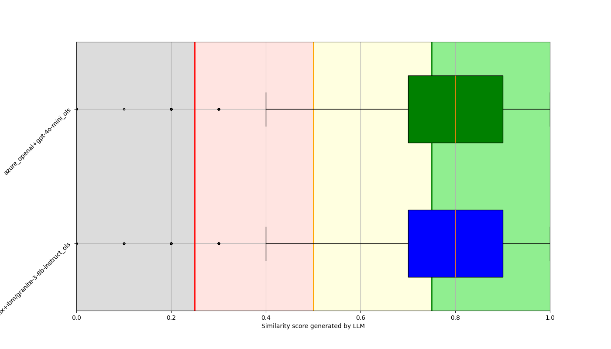
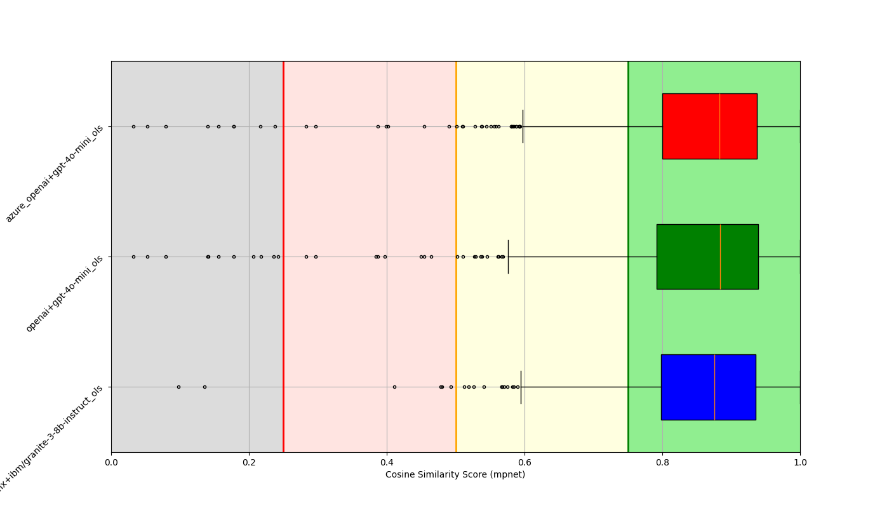
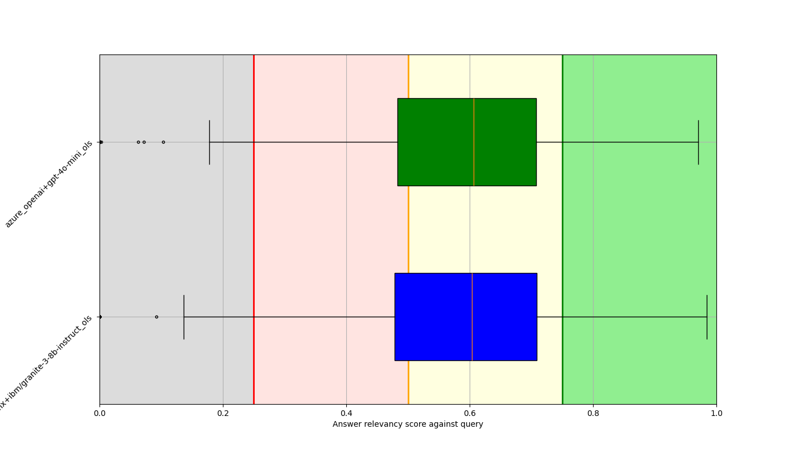
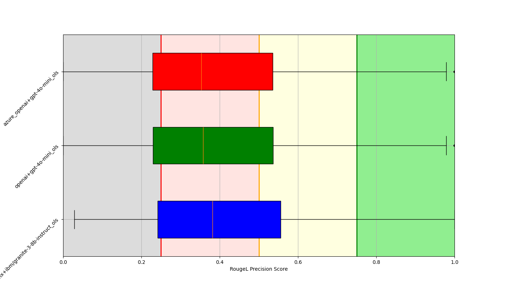
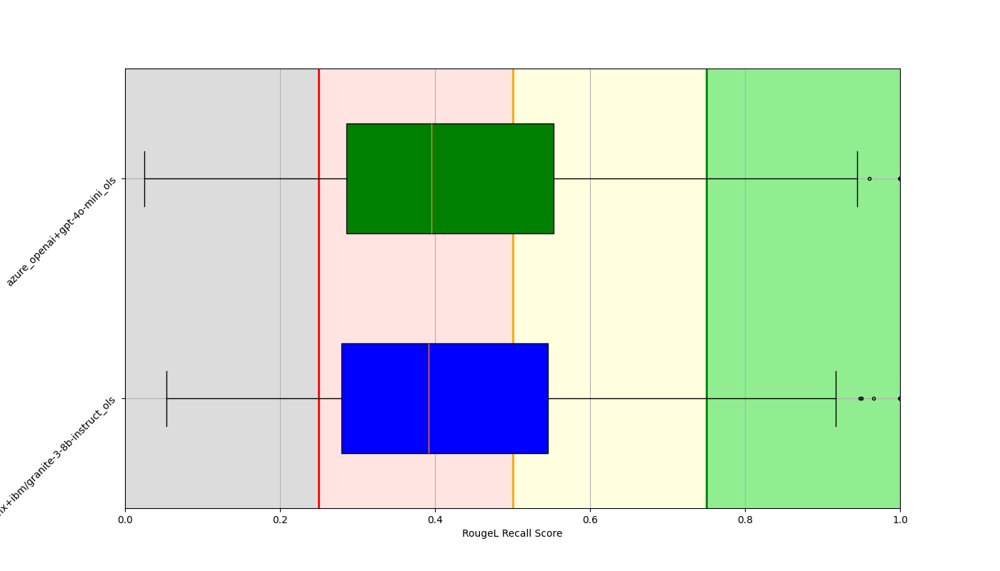
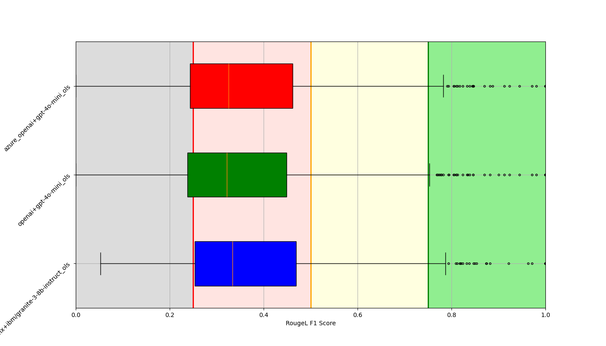

# Evaluation Result

**Notes**
- QnAs should `not` be used for model training or tuning. This is created only for evaluation purpose.
- QnAs were generated from OCP docs by LLMs. It is possible that some of the questions/answers are not entirely correct. We are constantly trying to verify both Questions & Answers manually. If you find any QnA pair to be modified or removed, please create a PR.
- [Instruction to run eval script](../../README.md)

## Result
- Last Execution date: `2025-05-07`
- Evaluated Provider/Models:
    - (watsonx) ibm/granite-3-2-8b-instruct (API Version: 2025-04-02)
    - (azure) gpt-4o-mini (Model Version: 2024-07-18, API Version: 2024-02-15-preview)
- Judge provider/model (LLM based eval): (watsonx) llama-3-1-8b-instruct
- QnA evaluation dataset: [QnAs from OCP doc](../ocp_doc_qna-edited.parquet)
- API run mode: without tool calling (streaming internally)
- RAG SHA: 56269892dcf5279b9857c04918e8fba587008990b09146e907d7af9303bd6c9e
    - OCP doc: 4.18
    - Embedding model: all-mpnet-base-v2
    - Splitter: Normal (chunk: 380)
    - Vector DB: faiss
    - Retrieval: Top 5 (cosine similarilty)

### Scores
Please look at below box-plots to have an idea about overall score for QnAs. `Ideal result`: Box should be as condense as possible and near to right side (close to 1).
#### Correctness/Similarity score generated by Model
Here we ask a judge model to score/grade response generated by OLS against the pre-defined/ground-truth answer.

#### Cosine Similarity
Cosine similarity between vector representation (generated by embedding model) of ground-truth answer & OLS response.

#### Answer Relevancy
Here we generate multiple questions from the response using a Model and calculate average cosine similarity score between the original query & the generated questions.

#### Rouge-L
These scores are based on stem words. Here the longest common subsequence (LCS) is being considered (not necessarily in order) between the predefined answer and the OLS response.
##### Rouge-L - Precision
Ratio of the length of the LCS over the unigrams in the response.

##### Rouge-L - Recall
Ratio of the length of the LCS over the unigrams in the pre-defined answer.

##### Rouge-L - F1
Harmonic mean of precision & recall.

[Score Summary](model_evaluation_summary.json)
Json file contains different quantile values for each of the score.